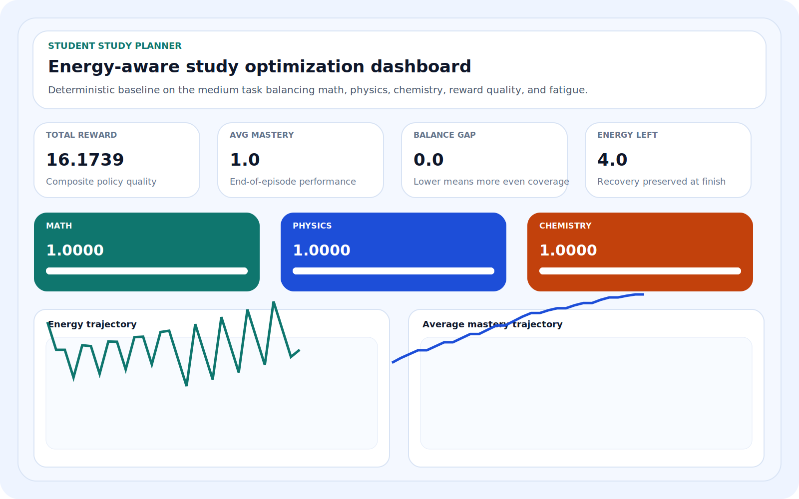
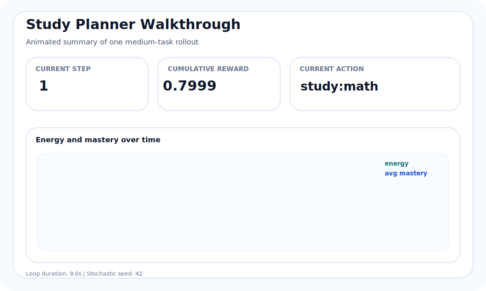

# EduDynamics 1.1.0

Student Study Planner with energy, balance, performance optimization, a liquid-glass analytics workspace, and more realistic learning dynamics.


An OpenEnv-style reinforcement learning environment where an agent must plan study actions across math, physics, and chemistry while managing fatigue, subject imbalance, and long-horizon performance.

Version `1.1.0` focuses on major bug fixes and quality improvements while keeping the `AuraUI 1.1.0` interface layer, the hybrid deployment, and the more realistic learning model with retention risk, memory strength, spacing, and recovery-aware planning.

Release history:

- see [CHANGELOG.md](CHANGELOG.md) for the version-by-version update log from `1.0.0` onward

## Submission Checklist Alignment

This repo is structured to satisfy the common first-round validator checks:

- FastAPI Space deployment with a `200` response at `/`
- HTTP environment endpoints for `reset`, `step`, and `state`
- root-level `inference.py`
- three tasks and a normalized grader score in the `0.0` to `1.0` range
- Dockerfile build path for automated repo validation
- pre-submission validation script via `python validate_submission.py`
- environment variable placeholders for `API_BASE_URL`, `MODEL_NAME`, and `HF_TOKEN`
- OpenAI baseline support through `OPENAI_API_KEY`
- OpenEnv packaging pieces including `pyproject.toml`, `uv.lock`, and `server/app.py`

## Preview

### Dashboard Screenshot



### Walkthrough GIF



## Why This Environment Matters

Real students do not just maximize raw study hours. They must:

- allocate time across competing subjects
- manage limited daily energy
- decide when to learn, reinforce, or recover
- avoid over-optimizing one subject while neglecting others

This makes study planning a strong real-world sequential decision problem. Short-term gains can hurt long-term performance if the policy ignores balance or recovery.

## What The Agent Controls

At every step, the agent chooses one of seven actions:

- `0`: study math
- `1`: study physics
- `2`: study chemistry
- `3`: revise math
- `4`: revise physics
- `5`: revise chemistry
- `6`: rest

Each episode spans multiple days, and each day contains three decision slots.

## Environment Design

The environment implements:

- `reset()`
- `step(action)` returning `(state, reward, done, info)`
- `state()`

Core simulation elements:

- three subjects with independent mastery values
- finite energy budget
- multi-day progression
- separate effects for studying, revising, and resting
- deterministic and stochastic execution modes

## Reward Design

The reward is intentionally multi-objective rather than a simple score delta.

It combines:

- average performance improvement
- balance across subjects
- energy efficiency
- targeted support for the weakest subject
- penalties for subject imbalance
- penalties for poor low-energy decisions
- mild penalties for wasteful rest actions

This encourages policies that make consistent progress without collapsing into one-subject optimization.

## Tasks

- `easy`: 5 days, lower mastery targets
- `medium`: 10 days, moderate planning horizon
- `hard`: 15 days, longer horizon with stronger balance demands

## Baseline Agent

The project includes two baseline modes:

- `openai`: uses the official OpenAI Python client and reads `OPENAI_API_KEY`
- `heuristic`: deterministic offline fallback for local validation and no-network runs

The deterministic fallback policy adapts to:

- current energy level
- weakest subject
- mastery imbalance

Behavior summary:

- rests when energy is critically low
- revises the weakest subject when imbalance becomes large
- studies the weakest subject when mastery is still behind
- stays reproducible for grading

The OpenAI baseline runs with temperature `0` so the action policy remains reproducible for a fixed model and prompt.

## What's New In 1.1.0

- appearance mode is now explicit and persistent inside the UI instead of relying on flaky browser/theme detection
- expensive reruns are cached so switching tabs and compare views feels much smoother
- shared version and branding labels are centralized to reduce UI drift and copy mismatches
- light-mode chrome, controls, and info panels were cleaned up for better readability
- hybrid UI/API branding was tightened so `EduDynamics` remains the app name while `AuraUI 1.1.0` stays the interface layer
- the real-learning model with spacing, forgetting, consolidation, and cognitive load remains intact

## Grading Strategy

The grader evaluates the deterministic baseline on all three tasks and reports:

- total reward
- average mastery
- balance gap
- remaining energy
- step count
- pass/fail checks against explicit thresholds

This makes the benchmark easier to interpret in a hackathon review setting.

## Project Structure

```text
study_planner_env/
├── study_env/
│   ├── __init__.py
│   ├── env.py
│   ├── tasks.py
├── app.py
├── inference.py
├── grader.py
├── openenv.yaml
├── README.md
├── Dockerfile
└── requirements.txt
```

## Run Locally

CLI baseline:

```bash
python inference.py
```

OpenAI baseline:

```bash
set OPENAI_API_KEY=your_key
python inference.py --agent openai
```

Seeded stochastic run:

```bash
python inference.py --stochastic --seed 42
```

Different result every run:

```bash
python inference.py --randomize
```

Grader:

```bash
python grader.py
```

Streamlit UI:

```bash
streamlit run app.py
```

API server:

```bash
uvicorn study_env.api:app --host 0.0.0.0 --port 8501
```

Pre-submission validation:

```bash
python validate_submission.py
```

## Hugging Face Demo

Live Space:

[https://huggingface.co/spaces/sukash0110/study_planner_env](https://huggingface.co/spaces/sukash0110/study_planner_env)

This repo is configured as a Docker-based Hugging Face Space and serves the `1.1.0` hybrid deployment on port `8501`:

- `/` shows a branded landing page with the embedded Streamlit demo
- `/ui` serves the full Streamlit application natively
- `/api/*` serves the OpenEnv-compatible API
- `/health` remains available through the mounted API

For validator-style API checks, the deployment also exposes:

- `GET /api/`
- `GET /api/health`
- `GET /api/tasks`
- `POST /api/reset`
- `POST /api/step`
- `GET /api/state`

## Required Environment Variables

The project includes `.env.example` with the required names:

- `API_BASE_URL`
- `MODEL_NAME`
- `OPENAI_API_KEY`
- `HF_TOKEN`

These are available as environment placeholders in the Docker image and can be overridden in your deployment configuration.

## Environment Notes

- studying gives larger gains but now interacts with spacing, fatigue, and memory durability
- revision improves one subject, reinforces others, and reduces retention risk when timed well
- end-of-day consolidation and forgetting make the learning loop more realistic
- rest restores energy and supports sustainable planning
- deterministic mode is intended for reproducible evaluation
- stochastic and randomize modes are intended for exploratory analysis
